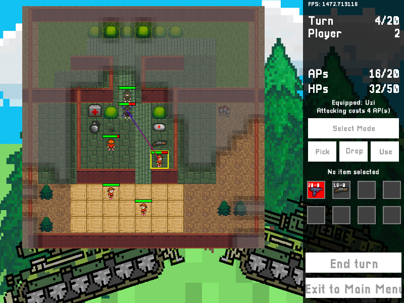

# Laser Squad



## Overview
Originally concieved as a Laser Squad clone, this project has little in common with its origins and is more like a 2-player turn-based action deathmatch game. A map editor together with some pre-made maps are featured.

The game was C++ programming school project made in a group of five people during one month. My responsibilities included the StatusMessage, Inventory and Item classes and and stuff in the Game and GameCharacter classes unrelated to shooting and line of sight. I also worked on the in-game and map editor UIs, drawing and input handling.

## Requirements
This game utilizes CMake for building. Furthermore SFML is also required. SFML 2.4 is recommended, but the game will compile with SFML 2.3 with minor visual reduction since SFML 2.3 compatibility was an original project requirement.

## Compiling
This project uses CMake to generate the build files. To compile using Make and CMake, navigate to the repository root folder and run the following commands:
```
mkdir build
cd build
cmake ../src
make
```
The game can then be started with the `LaserSquad` (Windows) or `./LaserSquad` (Linux) command.

This project uses Google Tests framework for unit testing. Add the variable 'test' and set it ON when building with cmake `cmake -Dtest=ON` to build unit tests.
```
cd build
cmake Dtest=ON  ../src
make LaserSquad_UnitTests
```

This creates `LaserSquad_UnitTests` that executes the unit tests.

